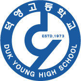

# 덕영고등학교 코드 에디터 (Deokyoung IDE)



## 소개

덕영고등학교 학생들을 위한 전용 코드 에디터입니다. Visual Studio Code 오픈소스를 기반으로 제작되어 모든 VS Code 기능을 포함하며, 학교 브랜딩이 적용되어 있습니다.

**기반:** Visual Studio Code 1.107.0 (Open Source)

## 주요 기능

- ✅ **완전한 VS Code 기능**: 디버깅, Git, 터미널, IntelliSense 등
- ✅ **확장 프로그램**: VS Code Marketplace의 모든 확장 설치 가능
- ✅ **다양한 언어 지원**: JavaScript, Python, Java, C++, HTML, CSS 등
- ✅ **덕영고등학교 브랜딩**: 학교 로고 및 이름 적용
- ✅ **Windows, macOS, Linux** 모두 지원

## 빌드 방법

### 1. 의존성 설치

```bash
npm install
```

### 2. 개발 모드 실행

```bash
# 코드 컴파일 (watch 모드)
npm run watch
```

다른 터미널에서:

```bash
# 애플리케이션 실행
./scripts/code.sh
```

### 3. 프로덕션 빌드 (선택사항)

macOS용:
```bash
npm run gulp vscode-darwin-arm64  # Apple Silicon
npm run gulp vscode-darwin-x64    # Intel Mac
```

Linux용:
```bash
npm run gulp vscode-linux-x64
npm run gulp vscode-linux-arm64
```

Windows용:
```bash
npm run gulp vscode-win32-x64
```

## 커스터마이징 내역

이 버전은 다음과 같이 커스터마이징되었습니다:

- **제품 이름**: 덕영고등학교 IDE / 덕영고등학교 코드 에디터
- **애플리케이션 ID**: `deokyoung-ide`
- **번들 식별자**: `kr.dyhs.deokyoung.ide`
- **데이터 폴더**: `.deokyoung-ide`
- **아이콘**: 덕영고등학교 공식 로고

## 학생 사용 가이드

### 설치 후 첫 실행

1. 애플리케이션 실행
2. 원하는 폴더 열기 (`File > Open Folder`)
3. 새 파일 만들기 (`File > New File`)
4. 코드 작성 시작!

### 유용한 기능

- **터미널**: `터미널 > 새 터미널` (단축키: Ctrl+`)
- **확장 프로그램**: 왼쪽 사이드바의 확장 아이콘 클릭
- **테마 변경**: `파일 > 기본 설정 > 테마 > 색 테마`
- **Git 사용**: 왼쪽 사이드바의 소스 제어 아이콘 클릭

### 추천 확장 프로그램

학생들에게 유용한 확장 프로그램:

- **Python** - Python 개발 지원
- **Live Server** - HTML/CSS/JS 실시간 미리보기
- **Prettier** - 코드 자동 포맷팅
- **GitLens** - Git 기능 향상
- **Korean Language Pack** - 한국어 인터페이스

## 시스템 요구사항

- **메모리**: 최소 2GB RAM (4GB 권장)
- **디스크**: 500MB 이상
- **OS**: macOS 10.15+, Windows 10+, 또는 최신 Linux

## 개발 환경 요구사항 (빌드용)

빌드를 위해서는 다음이 필요합니다:

- Node.js 20.x 이상
- Python 3.x
- Git
- 4GB 이상의 RAM
- 5GB 이상의 디스크 공간

## 원본 프로젝트

이 에디터는 [Visual Studio Code](https://github.com/microsoft/vscode)의 오픈소스 버전을 기반으로 합니다.

## 라이선스

MIT License - [LICENSE.txt](LICENSE.txt) 참조

원본 저작권: Copyright (c) Microsoft Corporation

## 덕영고등학교

**코딩으로 미래를 만들어가는 덕영고등학교를 응원합니다!** 🚀

---

*이 프로젝트는 교육 목적으로 제작되었습니다.*
